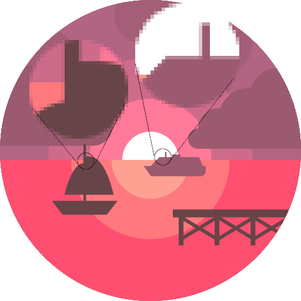

# scany
## About

The scany package is a denovo implementation the CL-AA antigrain algorithm in both a single thread or multi-threaded structure by ScanS and ScanT, respectivly. Both implement the rasterx.Scanner interface, and therefore they can be used with the rasterx and oksvg. The single threaded ScanS is vitually as fast as the ScanFT structure implemented in github.com/swiley/scanFT. Benchmarks vary a bit from run to run but ScanS appears to be within 1 or 2 percent as fast as ScanFT. The difference is that ScanFT is under the Freetype license, since it is a direct port from the C implementation of Freetype. while ScanS and ScanT are under the less restrictive MIT3 license, so they can be freely incoporated in commercial as well as open source projects.

If ScanT is run using a thread count of one it is around 10% slower than ScanFT or ScanS. However, as additional threads are added it will exceed the speed of the single thread implementations. At what point this occurs, depends on the image being rendered. SVG's with gradients, for example, particularly benefit from using multiple threads. Also note that number of threads specified may exceed the number of available CPU cores and still increase speed on some machines, while on others it may max out, so experimentation to determine the optimal thread number is advised.

Instead of the Painter interface used by Freetype to translate x y coordinates and alpha values to various image formats, scanY uses the scany.Collector interface. A Collector for the image.RGBA format is provided in the scany package. Collectors for additional formats may be provided by the user.

## How to use

To use the ScanS single threaded antialiaser with oksvg do the following:

```
img := image.NewRGBA(image.Rect(0, 0, width, height))
collector := &scany.RGBACollector{Image: img}
scanner := scany.NewScanS(width, height, collector)
raster := rasterx.NewDasher(w, h, scanner)
icon.Draw(raster, 1.0) // icon is an oksvg.Icon
```

Similarly to use the ScanT multi-threaded antialiaser do:

```
threadCount := 6
img := image.NewRGBA(image.Rect(0, 0, width, height))
collector := &scany.RGBACollector{Image: img}
scanner := scany.NewScanT(threadCount, width, height, collector)
raster := rasterx.NewDasher(w, h, scanner)
icon.Draw(raster, 1.0) // icon is an oksvg.Icon
```

All threads are started when the NewScanT method is called. There are three types of threads handling various steps of the CL-AA algorithm. One type breaks lines into cell sized segments, one calculates the cover and area, and places them into a linked list. Once these complete, the last type of thread sweeps the linked list scan lines, and adds the x, y alpha values to the target image format using the Collector.  When a thread count of one is specified, one of each thread type is created. Similarly if a thead count of six is used, six of each type of thread are created. The threads can be shut down by executing:
```
scanner.Close()
```
For an explanation of the CL-AA algorithm, see the [cl-vectors](docs/CL-VECTORS.pdf) file in the docs folder taken from [projects.tuxee.net](http://projects.tuxee.net/cl-vectors/section-the-cl-aa-algorithm).
See the test files for additional examples and benchmarks.




Thanks to [Freepik](http://www.freepik.com) from [Flaticon](https://www.flaticon.com/)
Licensed by [Creative Commons 3.0](http://creativecommons.org/licenses/by/3.0/) for the test icons used in the testdata/svg/landscapeIcons folder.


